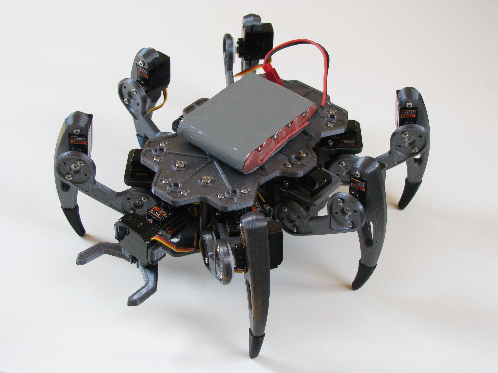
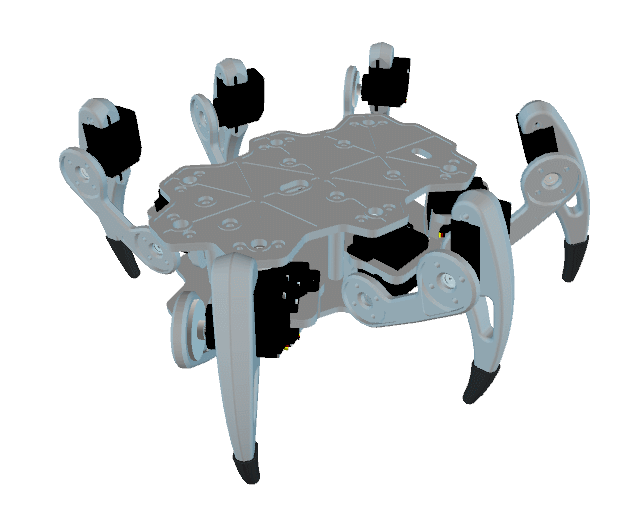

# ZeroBug - DIY Hexapod Robot

Zerobug is a 3D-printed micro-servo hexapod robot powered by a Raspberry Pi Zero and a STM32F103. The Pi Zero is in charge of the input methods and front end, making the robot controllable via mouse, keyboard, multitouch or simply a Bluetooth Gamepad. To get the robot walking, the STM32 handles leg locomotion, inverse kinematics and controls its 18 servos.





UPDATE 20.11.2021: Added support for video streaming with via the camera connector:
 - update the index-html file and copy "start_stream.sh" to the same directory on the desktop
 - install mjpg-streamer (e.g. using this guide: https://www.okdo.com/project/pc-webcam-with-raspberry-pi/?ok_ts=1635608250445)
 - add the following line to the /etc/rc.local file (before exit 0):
```
bash /home/pi/Desktop/hexapod/start_stream.sh
```
